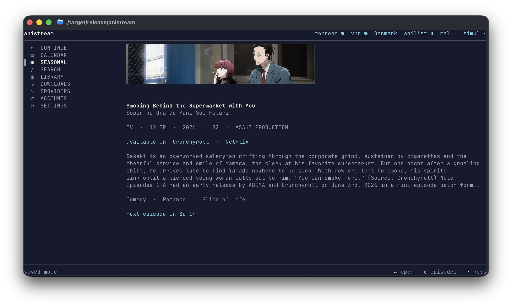
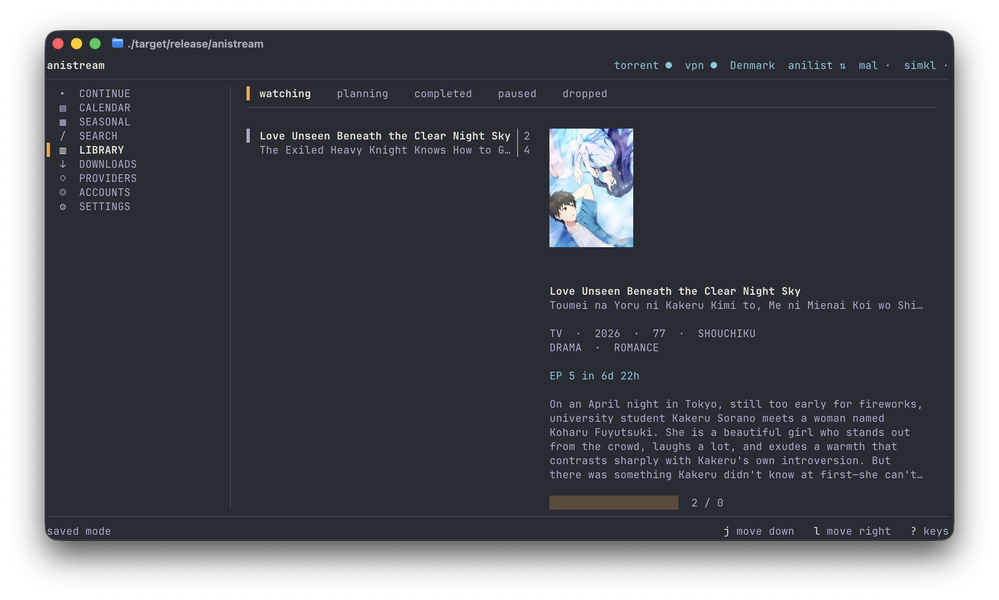
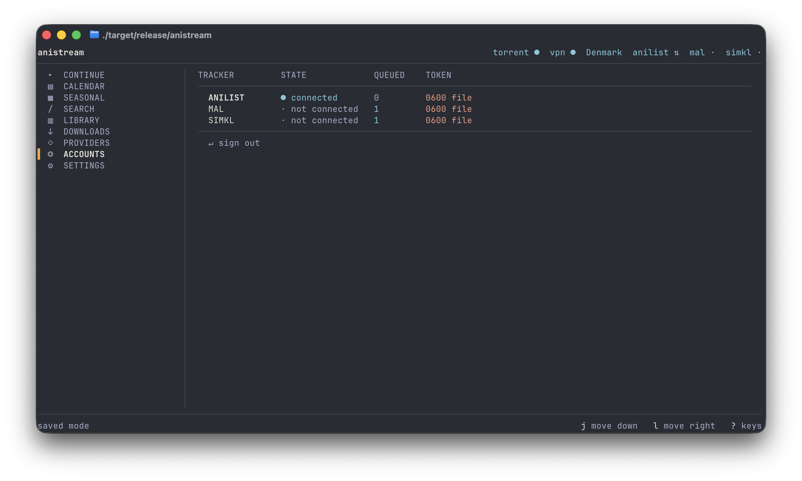
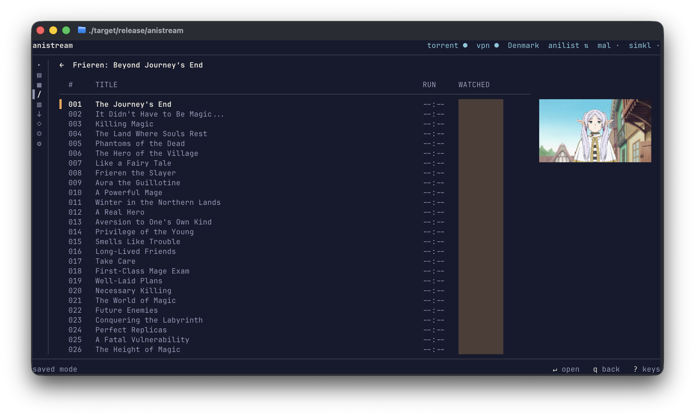
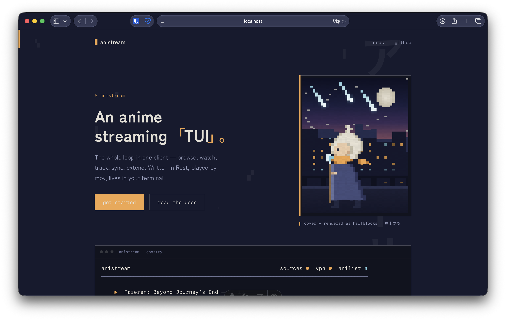

# anistream

An anime streaming TUI. Real image rendering, mpv for playback, pluggable everything.



## Features

Browsing, search and seasonal lists run off AniList and need no account. Watch history is local
SQLite. Playback is mpv driven over JSON IPC, with resume, aniskip, auto-next and remembered speed.

The home screen keeps a half-finished episode with its position, and the calendar spans a week
either side of today so what just aired is as visible as what is coming.



Torrent streaming uses librqbit, plays while downloading and is seekable. You supply the indexer.
It sits behind a fail-closed VPN guard and is unreachable without one. There is a downloads screen
for what you have pulled down, and completed files get their subtitles muxed in.

Sources are pluggable three ways: the torrent transport, a self-hosted Consumet-shaped API through
the `remote` provider, and WASM plugins written in Rust or JavaScript that run sandboxed.

Tracker sync covers AniList, MyAnimeList, Simkl and Trakt through an outbox that survives being
offline. Filler and recap episodes are marked from AnimeFillerList. Discord rich presence reports
what you are watching.

Kitsu sync is the one tracker not built. Crunchyroll streams are DRM-protected, so mpv cannot play
them and anistream will not work around that — episodes open in Crunchyroll instead.

## Requirements

macOS:

```sh
brew install mpv ffmpeg cmake      # cmake is for wreq's BoringSSL
rustup toolchain install 1.97.1    # pinned by rust-toolchain.toml
```

Windows:

```powershell
winget install --id Rustlang.Rustup
winget install --id Kitware.CMake
winget install --id NASM.NASM                              # aws-lc-sys assembles its own crypto
winget install --id Gyan.FFmpeg
winget install --id shinchiro.mpv
winget install --id Microsoft.VisualStudio.2022.BuildTools # "Desktop development with C++"
```

Add `rustup target add wasm32-wasip2` if you want to build plugins.

## Quick start

```sh
cargo run --release
```

You get browsing straight away, with no account and no config. Everything below is optional.

Use a terminal with a graphics protocol if you can — Ghostty, Kitty, iTerm2, WezTerm. Elsewhere it
falls back to halfblocks. `anistream --doctor` reports what yours supports.

## Configuration

Config lives at `~/.config/anistream/config.toml`, or `~/Library/Application Support/anistream/config.toml`
on macOS. Every section is optional.

```toml
[theme]
mode = "adaptive"      # inherit the terminal's background, or "immersive" for dusk indigo

[playback]
translation = "sub"
quality = 1080
commit_threshold = 0.85    # fraction of runtime that counts as watched and gets synced
auto_next = true
skip_opening = true        # skips it, and says so on mpv's OSD

[providers]
order = ["torrent", "plugins"]    # tried in order; failover walks the list
```

### Torrenting and the VPN guard

anistream gives you the torrent transport: a librqbit session behind the VPN guard, streamed over
loopback HTTP. It gives you no index of what to fetch. There is no built-in indexer and no default
endpoint, so the search URL, the trackers and any curation service are yours to supply, and the
source stays inert until they are.

Torrent traffic exposes your IP to every peer in the swarm, so none of this turns on until you pick
a VPN mode and the guard passes.

```toml
[providers.torrent]
enabled = true

# Required. `{query}` is replaced with the URL-encoded search terms; a template without it
# gets `q=` appended. Any RSS feed whose items carry seeders and an info hash will do —
# tag names are matched by local name, so the namespace does not matter.
rss_url = "https://your-indexer.example/?page=rss&q={query}"

# Required in practice: proxy mode disables DHT, so without trackers there are no peers.
trackers = [
  "udp://tracker.example:1337/announce",
  "udp://other.example:6969/announce",
]

# Optional. Answers "which release of this is the good one?", keyed on the AniList id. Picks
# pointing anywhere other than your indexer are ignored, since they cannot be played.
curation_url = "https://your-curation.example/api/records?filter=(alID={anilist_id})&expand=trs"

[providers.torrent.vpn]
mode = "socks5"                            # "socks5" | "external" | "none"
socks_url = "socks5://10.64.0.1:1080"      # Mullvad's in-tunnel endpoint
mullvad_exit = true                        # or require_asn_org = ["31173"]
verify_interval_secs = 60
on_leak = "pause"
```

The guard routes the session through your VPN's SOCKS5 proxy and forces DHT off, since
SOCKS5 UDP-associate is unreliable and librqbit does not document whether DHT is tunnelled. It
verifies egress through the proxy before any session starts, re-checks on an interval, and pauses
every torrent if a check fails.

This is application-level containment, not kernel-enforced: librqbit has no bind-to-interface
option, so the guard stops anistream leaking and nothing else on your machine. Add your VPN's kill
switch if you want a real guarantee:

```sh
mullvad lockdown-mode set on
```

`anistream --doctor` reports whether it is on. Mullvad's in-tunnel `10.64.0.1` is worth preferring
for a second reason: it is only reachable through the tunnel, so a dropped tunnel makes the proxy
unreachable instead of quietly leaking.

### Trackers

Local history needs no account. Sync is opt-in, and each service needs an app you register
yourself. There is no public client to borrow, and credentials shipped in an open-source binary
would not stay secret.

```toml
[trackers]
enabled = ["anilist", "mal", "simkl", "trakt"]
token_storage = "keychain"    # or "file" — see below

[trackers.anilist]
client_id = "…"
client_secret = "…"           # required: AniList has no PKCE and no public client

[trackers.mal]
client_id = "…"               # that is all: MAL is a public client, PKCE covers it

[trackers.simkl]
client_id = "…"

[trackers.trakt]
client_id = "…"
client_secret = "…"           # Trakt wants one on the token exchange
```

|                | AniList                                             | MyAnimeList                                                               | Simkl                                             | Trakt                                           |
| -------------- | --------------------------------------------------- | ------------------------------------------------------------------------- | ------------------------------------------------- | ----------------------------------------------- |
| Register at    | [anilist.co](https://anilist.co/settings/developer) | [myanimelist.net](https://myanimelist.net/apiconfig) — App Type **other** | [simkl.com](https://simkl.com/settings/developer) | [trakt.tv](https://trakt.tv/oauth/applications) |
| Sign-in flow   | browser redirect                                    | browser redirect                                                          | device code                                       | device code                                     |
| Redirect URL   | `http://127.0.0.1:45617/callback`                   | `http://127.0.0.1:45617/callback`                                         | none needed                                       | none needed                                     |
| Needs a secret | yes                                                 | no                                                                        | no                                                | yes                                             |
| Token life     | ~1 year                                             | 30 days, refreshed automatically                                          | long-lived                                        | refreshed automatically                         |

Then run `anistream --login`, or `anistream --login --tracker mal`. Simkl and Trakt use the OAuth
device flow, so `--login --tracker simkl` prints a code and a URL to enter it at. Check any of them
with `anistream --sync`.



Use `keychain` for `token_storage` on an installed build. Use `file`, which is `0600`, if you are
running from `cargo`: macOS keys keychain access on the binary, and every rebuild produces a new
one, so "Always Allow" never sticks and every run prompts you. `anistream --token-to-file` moves an
existing token across, and `ANISTREAM_TOKEN_STORAGE=file` overrides for a single run.

To check an indexer of your own end to end:

```sh
cargo run -p anistream-providers --example torrent_probe -- \
    'https://your-indexer.example/?page=rss&q={query}'
```

## Command line

These all exit without starting the interface, and the read-only ones take `--json`.

|                                                     |                                                                                                                            |
| --------------------------------------------------- | -------------------------------------------------------------------------------------------------------------------------- |
| `--doctor`                                          | Terminal support, mpv and its config, datasets, configured indexer, VPN guard, kill-switch state                           |
| `--search <query>`                                  | Search AniList                                                                                                             |
| `--stats`                                           | Watch statistics                                                                                                           |
| `--export <path>` \| `--import <path>`              | History as JSON; `-` for stdio                                                                                             |
| `--random`                                          | Pick something from your history                                                                                           |
| `--login [--tracker mal]` \| `--logout` \| `--sync` | Tracker accounts                                                                                                           |
| `--plugins`                                         | Installed plugins and what each may reach                                                                                  |
| `--stream-url <id> [--episode N]`                   | Resolve one episode to a URL and hold it open, so `mpv` or `curl` can be pointed at it                                     |
| `--preview 120x34 --screen home`                    | Render one screen as text: home, search, title, calendar, library, downloads, providers, accounts, settings, help, palette |
| `--refresh-data`                                    | Refresh the ID-mapping datasets                                                                                            |

## Matching titles

A torrent source has no catalogue, so titles are matched by name, and two releases sometimes score
within a point of each other. When that happens the episodes screen asks instead of failing:
candidates are listed best-first with the score each got and why any was passed over, and `↵` picks
one. The choice is stored as an override that the resolution ladder checks first, so you are only
asked once.



## Watched versus resumable

`commit_threshold`, 85% by default, decides when an episode counts as watched and gets pushed to a
tracker. It is set high so that opening an episode to check the subtitles does not mark it seen.

Resuming is separate. Quit an episode any time past thirty seconds and it shows up on the home
screen with its position, since quitting halfway is a clear signal you mean to come back. Only past
95% is an episode treated as too close to the end to resume.

## When playback fails

```sh
anistream --doctor                        # does mpv run, and which config is it reading
anistream --stream-url 154587 --episode 1 # resolve one episode, print the URL, keep it served
```

`--stream-url` separates the two failure modes. If `mpv --no-config <that url>` plays, the problem
is in anistream. If it does not, it is the player or the source, and mpv says which. anistream
captures mpv's stderr and surfaces the relevant line.

A slow start is usually plugin compilation — the JavaScript reference plugin takes about 874 ms.
`--plugins` lists what is installed; drop `"plugins"` from `providers.order` if you do not use them.

## Plugins

Provider plugins are WebAssembly components and can be written in any language targeting WASI 0.2.
See **[docs/plugins.md](docs/plugins.md)**. The sandbox has no sockets and the host lends `fetch`,
so a plugin is a parser rather than a networking stack.

`anistream --plugins` shows what each installed plugin may contact. That list is enforced host-side.

## Architecture

Ten crates, volatility increasing left to right:

```
 AniList        ID mapping        Provider         Player
 (stable)  ──►  (stable glue) ──► (volatile)  ──►  (stable)
                     │                                │
                     │                                ▼
                     │                    History (SQLite, local)
                     └──────────────────►  source of truth, offline
                      ids for every tracker           │
                                                      ▼
                                            Trackers (pluggable)
```

`anistream-core` (types and traits) · `-net` (HTTP, rate limiting) · `-meta` (AniList, ID mapping,
filler) · `-store` (SQLite) · `-providers` (torrent transport, remote, mock) · `-player` (mpv IPC) ·
`-track` (AniList, MAL, sync) · `-plugin` (WASM host) · `-ui` (ratatui) · `anistream` (wiring).

Sources decay, so every volatile piece sits behind a trait and the core never depends on one.

## Development

```sh
cargo test --workspace        # 901 tests, no network
cargo clippy --workspace --all-targets
cargo run -p anistream-ui --example screen_preview     # look at the layouts
```

The website and docs are in `website/` (Astro + Starlight): `cd website && bun run dev`.



There are also live probes. They need real services and are not part of `cargo test`:

```sh
cargo run -p anistream-providers --example stream_probe    # torrent path through the VPN
cargo run -p anistream --example playback_probe            # torrent → mpv → history
cargo run -p anistream --example sync_probe -- --write     # AniList push, then undo
cargo run -p anistream --example mal_probe -- --write      # MAL push, then undo
cargo run -p anistream-meta --example filler_probe         # filler parsing
cargo run -p anistream-meta --example episode_meta_probe   # episode titles, stills, numbering
cargo run -p anistream --example episodes_probe            # every stage from title to stream
cargo run -p anistream --example continue_probe            # resume vs. sync thresholds
```

## Scope

The metadata, mapping, player, tracker and plugin layers use documented public APIs. anistream
hosts no content and ships no catalogue of its own. The torrent source is a transport; what you
point any source at is your configuration, and the responsibility that comes with it is yours.
Torrenting is off by default and gated behind the VPN guard, and every source is a config edit away
from being removed. anistream will not circumvent DRM — Crunchyroll episodes open in Crunchyroll.

MIT.
